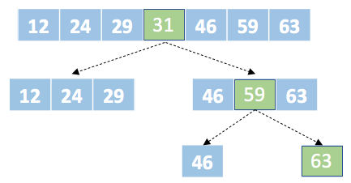

# Tabela Hash: Implementação em C

 
 
 
 

 

 

A tabela de dispersão ou espalhamento, comumente chamada de tabela hash, é uma estrutura que utiliza mecanismos de indexação para agilizar a pesquisa. Antes de apresentar essa estrutura, vamos imaginar um conjunto de elementos ordenados crescentemente. Para esse conjunto, uma maneira rápida, até o momento, de encontrar algo seria utilizar a pesquisa binária.

Na pesquisa binária, o conjunto ordenado é dividido ao meio a cada interação. O elemento mediano é então testado, se menor que o elemento buscado a parte esquerda do conjunto é descartado, caso contrário, a parte direita que é descartada. Essa ação de dividir e descartar é realizada até que o elemento a ser buscado seja encontrado ou o conjunto não possa ser mais dividido, indicando o fim da busca. Veja um simples exemplo a seguir, no qual o elemento 63 é alvo da pesquisa.

	 

 

A estrutura acima é conhecida em computação como árvores binárias, isso porque a partir de um nó chamado raiz, tem-se filhos a esquerda com valores menores que a raiz e filhos a direita com valores maiores. Valores iguais a raiz são organizados via regra, ou seja, podem ser armazenados junto com a raiz ou podem ser inseridos como filhos esquerdos ou direitos de acordo com a implementação. Independente disso, note que o custo para encontrar um elemento sempre cai pela metade a cada interação, logo, tem-se como pior custo  para encontrar o elemento desejado. Então, para nosso exemplo com 7 entradas, temos no máximo 3 interações do algoritmo ou  aproximadamente.

