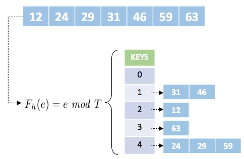

# Tabela Hash: Implementação em C

 
 
 
 

 

 

A tabela de dispersão ou espalhamento, comumente chamada de tabela hash, é uma estrutura que utiliza mecanismos de indexação para agilizar a pesquisa. Antes de apresentar essa estrutura, vamos imaginar um conjunto de elementos ordenados crescentemente. Para esse conjunto, uma maneira rápida, até o momento, de encontrar algo seria utilizar a pesquisa binária.

Na pesquisa binária, o conjunto ordenado é dividido ao meio a cada interação. O elemento mediano é então testado, se menor que o elemento buscado a parte esquerda do conjunto é descartado, caso contrário, a parte direita que é descartada. Essa ação de dividir e descartar é realizada até que o elemento a ser buscado seja encontrado ou o conjunto não possa ser mais dividido, indicando o fim da busca. Veja um simples exemplo a seguir, no qual o elemento 63 é alvo da pesquisa.

	 

 

A estrutura acima é conhecida em computação como árvores binárias, isso porque a partir de um nó chamado raiz, tem-se filhos a esquerda com valores menores que a raiz e filhos a direita com valores maiores. Valores iguais a raiz são organizados via regra, ou seja, podem ser armazenados junto com a raiz ou podem ser inseridos como filhos esquerdos ou direitos de acordo com a implementação. Independente disso, note que o custo para encontrar um elemento sempre cai pela metade a cada interação, logo, tem-se como pior custo  para encontrar o elemento desejado. Então, para nosso exemplo com 7 entradas, temos no máximo 3 interações do algoritmo ou  aproximadamente.

Na tabela hash, uma função de transformação recebe cada elemento da entrada e gera uma chave para ele, armazenando-o em uma dada posição da tabela, endereçada pela chave. Formalmente, essa função pode ser representada como , em que o subconjunto da entrada de tamanho M é mapeada na posição  da tabela.

Em literatura, há diversas implementações para a função <i>h</i>, sendo algumas dessas o resto da divisão, meio do quadrado, método da dobra, método da multiplicação, hashing universal.

> <b> Observação:</b>
>
>Se a escolha de tal função for adequada ao conjunto e houver entradas suficiente para armazenar todos os elementos sem a repetição de chaves, o custo da pesquisa será . 

Vejamos um exemplo utilizando como função o resto da divisão para o conjunto de dados apresentado no exemplo de pesquisa binária. Para este exemplo, considere a variável <i>T</i> como tamanho da tabela hash e "<b>e</b>" como o elemento a ser indexado.

	 

 

Observe através do exemplo que se a função utilizada for adequada e houver espaço suficiente para armazenar um único elemento por posição a estrutura em hash pode alcançar tempos de , o qual se refere ao melhor tempo de execução / melhor caso. Para o caso médio é provável algo próximo de  e no pior caso . Note pelo exemplo, que a função em questão mapeou mais de um elemento por posição. Para essa condição da-se o nome de colisão e a forma mais comum de trata-la é utilizando lista simplesmente encadeada como entrada de cada chave da tabela.

# Compilação e Execução

A tabela hash disponibilizada possui um arquivo Makefile que realiza todo o procedimento de compilação e execução. Para tanto, temos as seguintes diretrizes de execução:

| Comando                |  Função                                                                                           |
| -----------------------| ------------------------------------------------------------------------------------------------- |
|  `make clean`          | Apaga a última compilação realizada contida na pasta build                                        |
|  `make`                | Executa a compilação do programa utilizando o gcc, e o resultado vai para a pasta build           |
|  `make run`            | Executa o programa da pasta build após a realização da compilação                                 |

# Contatos

<a style="color:black" href="mailto:michel@cefetmg.br?subject=[GitHub]%20Source%20Dynamic%20Lists">
✉️ <i>michel@cefetmg.br</i>
</a>
